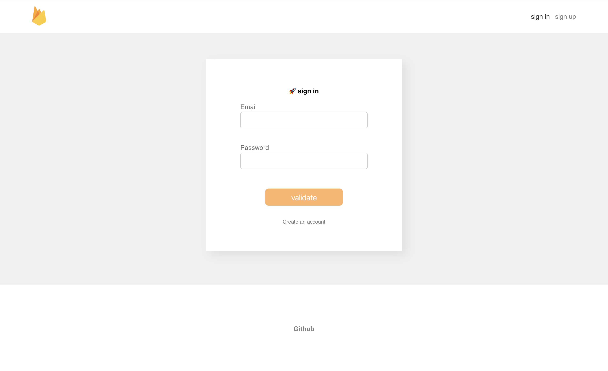

## Firebase authentication boilerplate with hooks!

Quick setup for getting started with firebase auth within a react application using the context API as an alternative to redux.

[Live example 👀](https://pensive-villani-57d695.netlify.com/#/signup).


### This project uses :

-   [Create React App](https://github.com/facebook/create-react-app).
-   [Firebase](https://firebase.google.com)
-   [React-hook-form](https://github.com/react-hook-form/react-hook-form)

### usage :

Replace the firebase config by yours, and sucure necessary data to a .env file, e.g :

```
REACT_APP_API_KEY='YOUR_KEY'

const app = firebase.initializeApp({
    apiKey: process.env.REACT_APP_API_KEY,
    ...rest,
})
```

the context return several methods for user authentification e.g, signInUser, signUpUser etc, ... (it can be completed using other firebase method e.g, recover password ...).
It also returns a 'user' object that gives informations about the user that is currently logged in.
