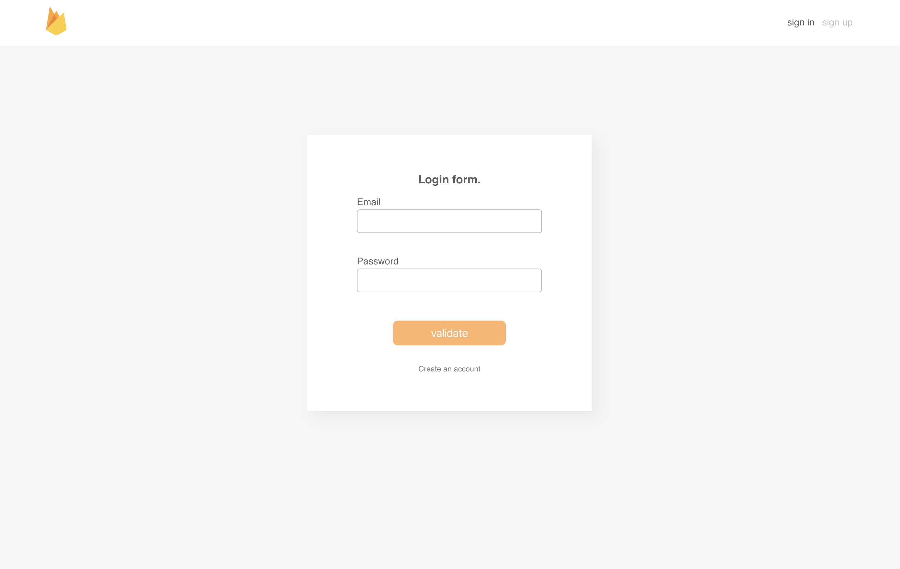

## Firebase authentication boilerplate with hooks!

Quick setup for getting started with firebase auth in a react application using the context API as an alternative to redux.
- [Live example](https://pensive-villani-57d695.netlify.com/#/signup).




### This project uses :

-   [Create React App](https://github.com/facebook/create-react-app).
-   [Firebase](https://firebase.google.com)
-   [React-hook-form](https://github.com/react-hook-form/react-hook-form)

### usage :

Replace the current firebase config by yours, and place data in a .env file, ex :

.env
```
REACT_APP_API_KEY='YOUR_KEY'
```

firebase.js
```
const app = firebase.initializeApp({
    apiKey: process.env.REACT_APP_API_KEY,
    ...rest,
})
```
